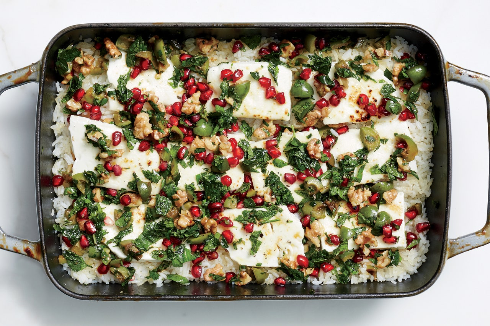

[Baked Minty Rice with Feta and Pomegranate Relish Recipe](https://www.epicurious.com/recipes/food/views/baked-minty-rice-with-feta-and-pomegranate-relish)

*6 servings*

## Ingredients
* 1/2 cup walnuts
* 3/4 cup pomegranate seeds (from about 1/2 large pomegranate)
* 3/4 cup Castelvetrano olives, pitted, coarsely chopped
* 1/2 cup olive oil
* 1/4 cup coarsely chopped fresh mint
* 1/4 cup coarsely chopped fresh parsley
* 1 tablespoon pomegranate molasses
* 1 garlic clove, crushed
* Kosher salt, freshly ground pepper

## Rice and assembly:
* 2 cups basmati rice
* 4 tablespoons unsalted butter, cut into pieces
* 3/4 teaspoons kosher salt
* 10 mint sprigs
* 8 ounces feta, sliced 1/4” thick

### Pomegranate relish:

Place a rack in upper third of oven; preheat to 175°C. Toast walnuts on a rimmed baking sheet, tossing once, until golden brown, 5–8 minutes. Let cool, then coarsely chop. Increase oven temperature to 225°C.

Toss walnuts, pomegranate seeds, olives, oil, mint, parsley, pomegranate molasses, and garlic in a medium bowl to combine. Season with salt and pepper.

### Rice and assembly:

Combine rice, butter, and salt in a 13x9” baking dish, then pour in a scant 3 1/2 cups water; top with mint sprigs. Cover tightly with foil and bake until rice is tender and water is absorbed, 30–35 minutes. Remove from oven; pluck out mint. Fluff rice with a fork.

Heat griller. Arrange feta over rice. Grill until rice around edges of pan is browned and crisp and feta is starting to brown, 8–10 minutes. Spoon pomegranate relish over.
