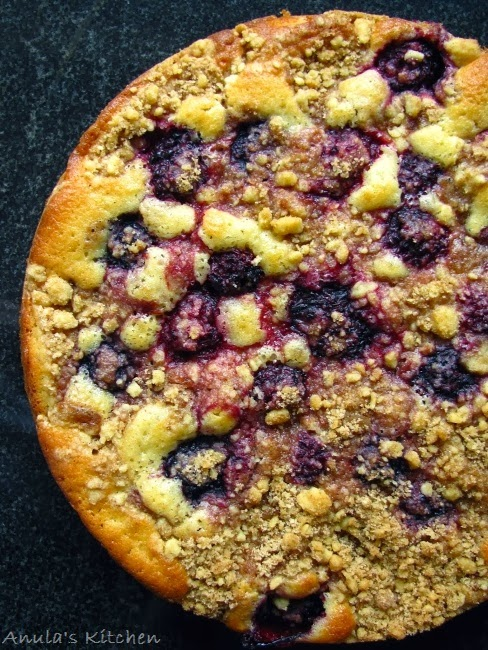

# [Apple & blackberry streusel cake](http://www.anulaskitchen.com/2014/03/apple-blackberry-streusel-cake-recipe.html)

## Ingredients
**For the cake:**  
- 60 g unsalted butter  
- 140 g plain flour  
- 80 g caster sugar  
- 1 egg  
- 1/2 teaspoon vanilla extract  
- 1 teaspoon baking powder  
- 1/2 teaspoon salt  
- 80 ml oat or soy milk  
- 3 granny smith apples  
  
**For the** **streusel** **topping:**  
- 70 g plain flour  
- 1/2 teaspoon ground cinnamon  
- 40 g unsalted butter, chilled and diced
- 50 g soft light brown sugar

## Method  
- Pre-heat oven to 170 C. Grease a cake pan with butter and set aside. I also line mine with greaseproof paper. 

  

To make the streusel topping 

- Sift the flour and cinnamon together. 

- Cut the cold butter into small pieces and rub into the flour and cinnamon mixture with fingertips until the streusel comes together like bread crumbs. 

- Add the brown sugar and mix well. 

- Set aside until needed. 

**For the cake sponge** 
Take the softened butter in a large enough bowl & add the sugar and cream together until well combined and soft. 

Add the egg and vanilla. Beat well with a whisk until combined. You can also use an electric beater or stand mixer but it's not really needed. 

In a bowl whisk the flour, salt and baking powder together. Add half of this to the egg mixture with half of the milk and whisk the batter gently until well combined. Add the rest of the flour and the milk and mix well again. 

Pour your cake sponge mix into the greased pan and spread evenly. Layer the sliced apples on top and your blackberries if you're using any. You can make this layer as thick or thin as you like. 

Sprinkle the streusel evenly on top. 
Bake in the pre-heated oven for 35-40 mins or until a skewer inserted into the centre comes out with moist crumbs. 

- Serve warm or cold.