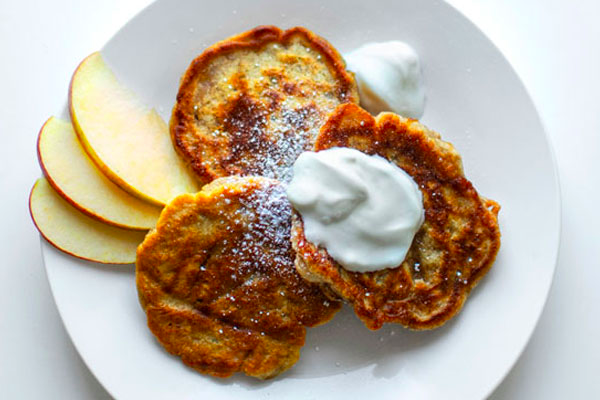

Apple Racuchy are one of the favorite Polish suppers. Children love them and they are simple and easy to make. I don’t add sugar inside, so you can keep them low caloric or sprinkle Racuchy with lots of powder sugar. My Racuchy are crispy and fluffy, even though I don’t use yeast nor baking powder

## Ingredients

* 2 cups milk
* 2 cups flour
* 2 eggs
* 3 apples
* salt
* powder sugar
* oil for frying

Separate egg whites from the yolks.

Combine flour with milk and 2 yolks in a bowl. Sprinkle with a pinch of salt. Beat Ingredients with electric mixer till the batter is creamy. It should be quite thick. You can lightly adjust milk and flour amounts, if you think the dough is too thin or too thick (compare with the picture no 3 below).

Peel apples. I cut them in hand into small irregular pieces. They should be more less the same and rather flat, so that the pancakes were easy to fry. Mix apples with the dough.

In another bowl beat the egg whites till stiff. Add them gently to the dough with a spoon. The dough has to be thick at the beginning, as it gets thinner at this stage. This is actually the secret of the recipe. Beaten whites make the batter delicate and fluffy without adding baking powder, soda nor yeast:)

Start frying straight away.

Heat the frying pan, drop the batter by large spoonful into the medium hot oil and fry for 3-4 minutes on each side till golden. Don’t make the oil too hot, give more time for Racuchy, so that they were the best.