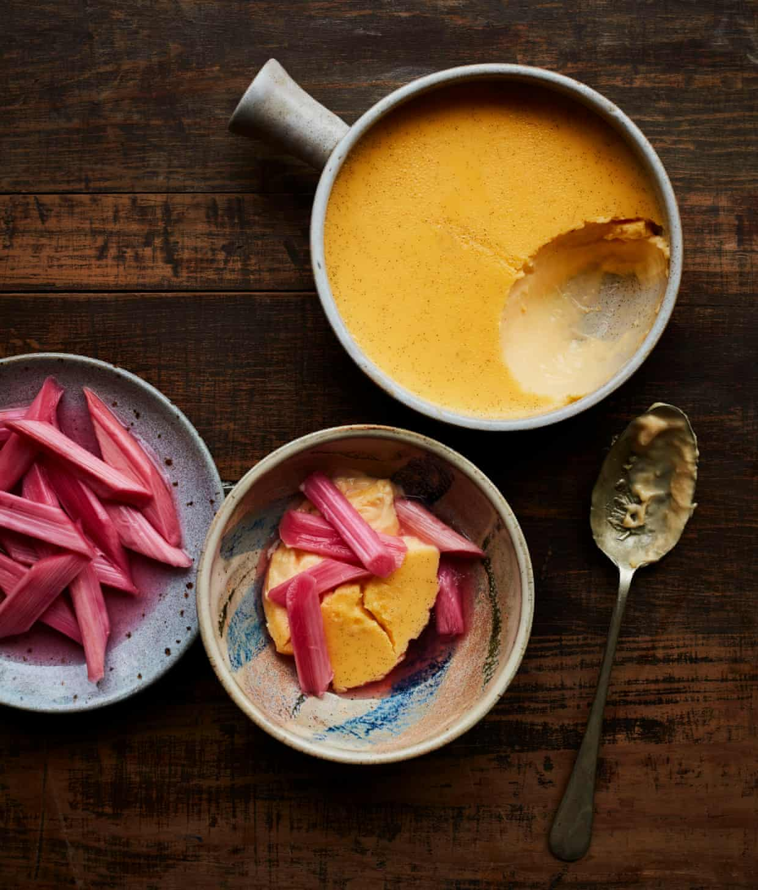

# [Baked custard with roast rhubarb](https://www.theguardian.com/food/2021/feb/27/ravneet-gills-recipe-for-baked-custard-roast-rhubarb)

Prep: 15 min
Macerate: 30 min
Cook: 1 hr 15 min
Chill: 1-2 hr
*Serves 3-4*

**For the custard**
300ml double cream
200ml whole milk
120g caster sugar
1 vanilla pod
120g egg yolk
1 pinch salt

**For the rhubarb**
200g forced rhubarb, washed, trimmed and cut into 5cm pieces
55g caster sugar

Juice of  **½** lemon

Put the rhubarb in a large, deep roasting tin with the sugar and lemon juice, mix with your hands until well coated. Ideally, you want the rhubarb to sit in one single layer in the tray, so spread it out and set aside to macerate for half an hour.

Heat the oven to 190C (170 fan)/gas 5, then roast the rhubarb for 10-15 minutes. Keep an eye on it, though – you want the rhubarb to soften slightly but maintain its. Remove from the oven (remember it will carry on cooking for five minutes once it’s out) and leave to sit for a few hours.

Now, make the custard. Lower the oven to 150C/300F/gas 2 – if possible, it’s best not to use a fan oven, because it can be a bit harsh for something this delicate and will sometimes make for an uneven top, too. Warm the cream, milk and half the sugar together with the vanilla pod. In a bowl, whisk the egg yolks with the remaining sugar by hand, pour in the warmed cream mixture and stir with a whisk. Return the custard mixture to the pan and, over a low heat, stir constantly with a spatula until it’s roughly 80C.

Add a pinch of salt, remove and discard the vanilla pod and take off the heat. Boil the kettle.

Pour the custard into a ceramic dish that can hold 800ml liquid (I used an 18cm x 23cm oval one) and cover the top with clingfilm, making sure it doesn’t touch the custard.

Put the dish into a larger dish or roasting tin and slide it into the oven. Pour the hot water from the kettle into the larger dish to come halfway up the sides of the custard dish, and bBake for 35-40 minutes, until the middle is jiggly.

Carefully remove the clingfilm, leave to cool for an hour, then put in the fridge to chill completely. Enjoy the custard cold with the rhubarb. Any leftover rhubarb will keep in an airtight container in the fridge for three days.