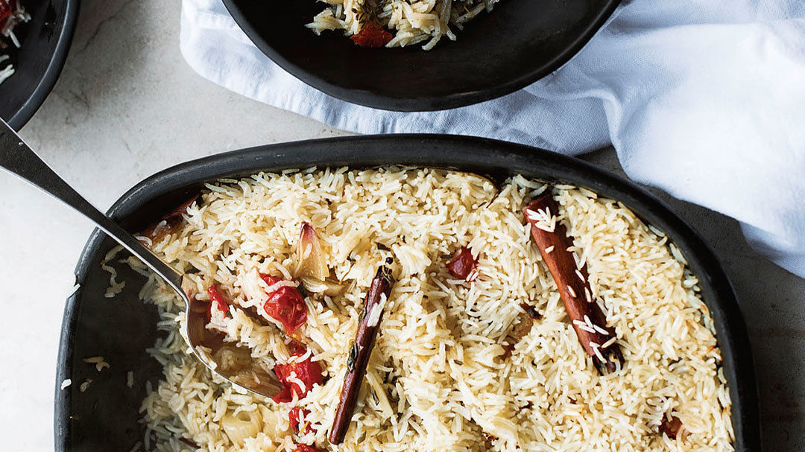

[Baked Rice with Confit Tomatoes and Garlic](https://www.finecooking.com/recipe/baked-rice-with-confit-tomatoes-and-garlic)

This was my go-to side for a few months, working well with pretty much anything else on the table. There’s also enough going on, flavour-wise, for it to be lovely as it is, as a main. Peeling so many garlic cloves won’t win me any “simple” brownie points, I know, but once done, the simple joy of this dish is that the rice is baked in the oven rather than cooked on the stove. For those who find creating perfectly cooked rice in a pan of simmering water strangely difficult, this will be a revelation. Just make sure the foil is sealed tightly over the dish—you don’t want any steam to escape in the oven.

## Ingredients

* 800gm cherry tomatoes
* 12 large garlic cloves (or 25 small), peeled (2/3 cup)
* 4 large shallots, peeled and cut into 1-1/4-inch pieces (1 cup)
* 1-1/4 cups coriander stems, cut into 1-1/2-inch lengths, plus 1/2 cup leaves, roughly chopped, to serve
* 3 Tbs. thyme leaves
* 4 small cinnamon sticks
* 7 Tbs. olive oil
* Salt and black pepper
* 1-1/2 cups basmati rice
* 2-1/2 cups boiling water

## Preparation

Preheat the oven to 175°C.

Arrange the tomatoes, garlic, shallots, cilantro stems, thyme, and cinnamon sticks in a large high-sided casserole dish, about 8×12 inches. 

Pour in the olive oil, add 1/2 tsp. of salt and a good grind of black pepper, and place in the oven for 1 hour, until the vegetables are soft. 

Remove from the oven, sprinkle the rice evenly over the vegetables, without stirring them together, and set aside.

Increase the oven temperature to 220°C. Sprinkle 1/2 tsp. of salt and plenty of black pepper over the rice and then carefully pour the boiling water over the rice. 

Seal the dish tightly with foil and place in the oven for 25 minutes, until the rice is cooked. 

Remove from the oven and set aside for 10 minutes, still covered. Remove the foil, sprinkle with the cilantro leaves, stir these very gently into the rice, and serve.