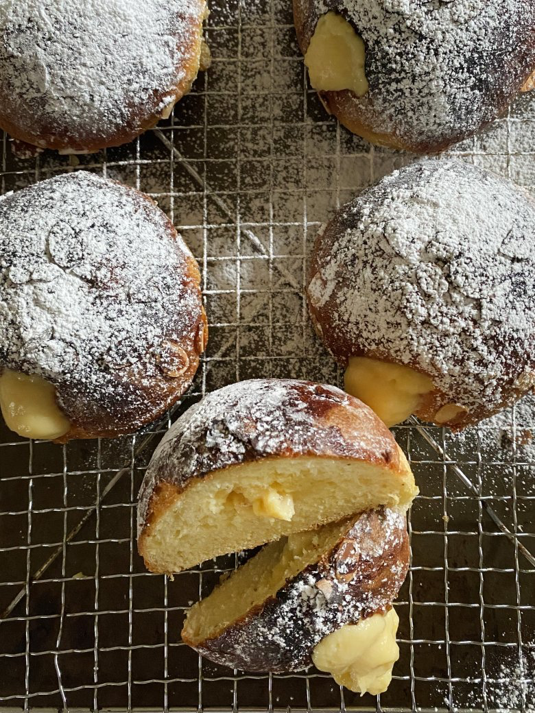

# [ Bee Stings](https://www.thesaturdaypaper.com.au/food/dessert/2021/06/30/bee-stings/162402480011882#mtr)

A bee sting cake is a staple of the German cake stand. It is usually baked in a cake tin and then split and filled with a vanilla pastry cream. It’s not a cake, though; it’s actually a bread.

In my version here I like to make oversized individual brioche buns and fill them with a pastry cream that has been augmented with a hint of honey.

Brioche dough is a yeasted dough that is enriched with egg yolks and butter. This particular recipe earns the moniker of “my best brioche”, as it is far richer than the more utilitarian and pared-back version I use for everyday things.

Mastering the process of making brioche can add a whole new set of recipes to your arsenal. It has made a bit of a comeback in recent years, but in unlikely places. I first learnt of brioche in its most traditional form – made in a fluted tin mould with a little button on the top – but many would know it as a burger bun or a version of a doughnut. It may seem strange to use the slightly sweet, rich brioche dough as a burger bun, but it does in fact have a long history in French cuisine as a wrapping for savoury food. The town of Lyon specialises in a lyonnaise sausage wrapped in brioche and baked. And at street markets you can find a Danish pastry style treat of a square of brioche folded over a filling of spinach, mushrooms and cheese, or ham, gruyère and bechamel.

Here, though, it’s in its more regular form, used as a traditional sweet-filled pastry.

**Ingredients**

*Makes 12*

Brioche dough

* 500g plain flour
* 1 tsp salt
* 250ml milk
* 2 tsp instant dried yeast
* 40g sugar
* 6 egg yolks
* 150g soft unsalted butter

Topping

* 50g butter
* 55g castor sugar
* 1 tbsp honey
* 1 tbsp milk
* pinch salt
* 80g flaked almonds

Pastry cream filling

* 500ml milk
* 1 vanilla bean
* 6 egg yolks
* 100g castor sugar
* ¼ cup honey
* 50g cornflour mixed with 50ml milk to form a paste

**Method**

1. Combine the flour and salt in the bowl of a stand mixer.
2. Warm the milk to blood temperature and add the yeast and sugar. Stir to dissolve. Add the egg yolks and whisk together.
3. Fit the mixer with the paddle attachment and, while pouring the liquid into the flour mixture, start beating. Beat for five minutes on a moderate speed. Increase the speed and add the butter bit by bit, slapping the dough vigorously. The dough should come away from the sides of the bowl during this process.
4. Place the dough in a clean bowl and allow it to rise for two hours until it more than doubles in size. Knock it back, turn out onto a work surface, cut into 12 pieces and roll into balls.
5. Place the balls on a silicone mat or baking paper on a baking sheet.
6. Preheat the oven to 220°C.
7. Allow the balls to rise in a warm, draft-free place for 30-60 minutes or until doubled in size.
8. To make the topping, place the butter, sugar, honey and milk in a saucepan over low heat. Stir until the butter is melted and all Ingredients are combined. Stir in the nuts and then gently spoon the topping onto the buns.
9. Place the baking tray in the centre of the oven, turn the heat down to 180°C and cook for 18-20 minutes. Cool on a wire rack.

Pastry cream filling

1. Bring the milk to scalding point with the vanilla bean split in two.
2. Beat the egg yolks, sugar, honey and cornflour until pale. Pour the hot milk onto this mixture and combine. Return to the saucepan, boil and cook until thick.
3. Scrape into a clean container and cover directly with plastic wrap or paper to stop the custard forming a skin. Cool and refrigerate.
4. When ready to serve, put the custard in a piping bag fitted with a metal nozzle. Pierce the side of each brioche bun and squeeze in as much filling as you can.
5. Dust with icing sugar and serve.