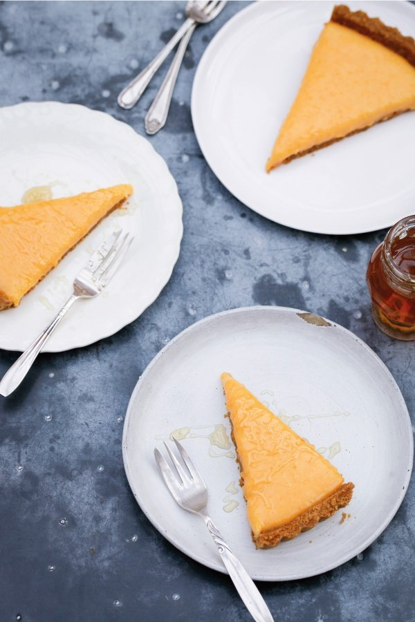

Although I make the most of the Seville orange season (December to February), that bitter orange taste is too good to forsake during the long months that Seville oranges are not about. Then I simply try to recreate their floral sharpness by using regular orange and lime juices in something approximating a 2:1 ratio. If you want to do the same, then use 60ml / ¼ cup lime juice (from 2-3 limes) and 140ml / ½ cup plus 1 tablespoon orange juice (from 1 large or 2 medium oranges).

I have to say, that when Seville oranges are in season, this tart looks like a disc of winter sunshine on the plate – and tastes like it, too. I must also add that the curd is just as fabulous spread over toasted crumpets or proper white bread.

*Yields: 10-14 slices*

## Ingredients

**for the base**
-   250 grams gingernut biscuits or plain ginger biscuits/cookies
-   75 grams soft unsalted butter

**for the curd filling**
-   3 large eggs
-   2 egg yolks
-   100 grams caster sugar
-   zest and juice of 4 seville oranges (see intro)
-   150 grams soft unsalted butter (cut into 1cm / ½-inch cubes)

**to serve**
-   good runny honey

## Method

You will need 1 x 24cm / 10-inch loose-bottomed, shallow tart tin.

Process the ginger biscuits until crumbled and no longer whole, then add the butter and process again, patiently waiting until it begins to clump and look like damp, dark sand. If you don’t have a processor, put the ginger biscuits in a freezer bag or resealable plastic bag, and bash with a rolling pin or similar heavy implement, even if it has to be one with less comedy value. Melt the butter, and transfer the crumbs to a bowl. Mix in the melted butter until the crumbs are evenly coated.

Tip into your tin, and carefully spread the biscuit base all around the tin and up the sides; you can do this with your hands or the back of a spoon.

Put the tin in the fridge, to allow the biscuit base to harden, for at least 1 hour – although it may take up to 2 hours if your fridge is stacked. I often find it easier to get the base done in advance, so it’s coolly ready and waiting, in which case, I do it up to 2 days ahead.

Once your base is set firm you can get on with your curd filling. In a heavy-based saucepan – off the heat – whisk together the eggs (both the whole eggs and the yolks) and sugar, making sure you incorporate them well.

Add the orange zest (grate gently so you don’t get the pith, too) and juice from the oranges (and lime juice, if using the lime-orange combo) along with the cubes of butter, then put the pan over a medium heat and cook, stirring constantly; I use a small flat whisk for this.

This thickening process will take about 5–7 minutes, but do take it off the heat regularly during this time, while you carry on whisking, to prevent it from getting too hot. Once the curd has thickened, take it off the heat, keep whisking for about 30 seconds, and carry on doing so as you pour it straight into a jug (it makes about 550ml / 2¼ cups). Then place a piece of dampened baking parchment or greaseproof paper on top of the filling (this will stop it forming a skin), and let it cool in the fridge for about 30 minutes. Once the filling has cooled, but not set solid, pour and scrape it into your biscuit-lined tin and spread it out evenly.

Let the tart set further in the fridge for at least 4 hours (or overnight), and up to 2 days, before unmoulding. This is best done while it is still cold – so don’t take it out of the fridge for more than 5–10 minutes before you want to cut it. Then serve in slices, with a little pot of runny honey for people to drizzle over as they wish.