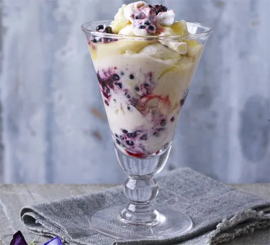

# [Blackberry & Lemon Mess](https://www.bbcgoodfood.com/recipes/blackberry-lemon-mess)

*Serves 6*

## Ingredients

* 600ml tub whipping cream
* 3 tbsp icing sugar
* 6 tbsp lemon curd
* 200g [blackberry](https://www.bbcgoodfood.com/glossary/blackberry-glossary)
* few primroses or other edible flowers , to decorate (optional)

### For the meringues

* 2 large egg whites
* 140g caster sugar
* 1 tsp cornflour
* 1 tsp white wine vinegar

## Method

Heat oven to 120C/100C fan/gas ½. Line a baking sheet with baking parchment. To make the meringues, put the egg whites in a clean mixing bowl and beat with an electric whisk to stiff peaks. Tip in half the sugar and beat again until shiny and stiff. Add the remaining sugar with the cornflour and vinegar and beat back to shiny and stiff. Dollop 5 very large spoonfuls onto the baking sheet and bake on a low shelf for 1 hr until crisp and the meringues peel easily from the paper. Cool. The meringues will keep in an airtight container for up to 3 days, or in the freezer for up to 3 months.

Tip the cream into a large bowl, sift in the icing sugar and gently whip until soft peaks just hold a little shape. Chill until ready to serve.

To serve, dollop the lemon curd over the whipped cream, then crumble over some of the meringues in small chunks – you probably won’t need them all. Put the blackberries into a bowl and lightly rough up with a fork so they’re whole but juicy, then scatter them over the cream. Fold together with a large spatula or spoon, just a few times to marble everything through. Divide between 6 glasses or bowls, top each with an edible flower, if using, and serve straight away.