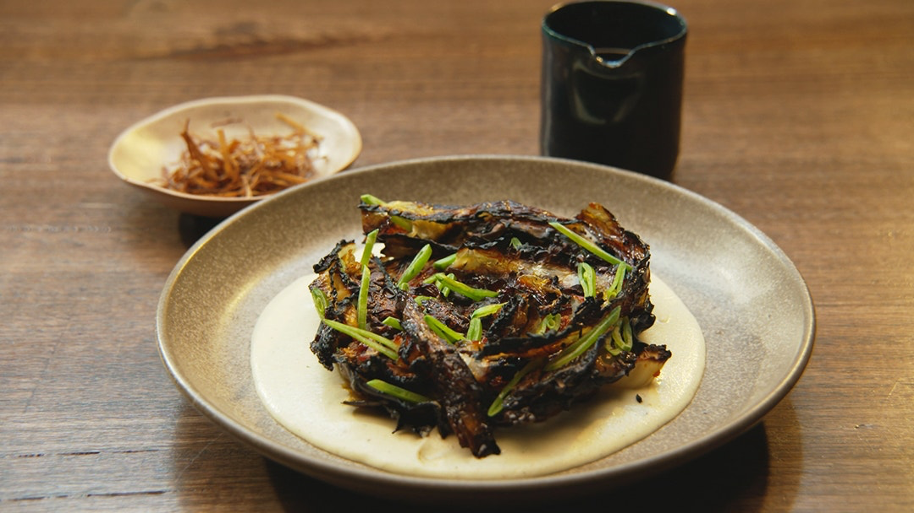

# [Burnt Cabbage, Leek Purée, Chilli Oil](https://10play.com.au/masterchef/recipes/burnt-cabbage-leek-puree-chilli-oil/r220330bmzke)

## Ingredients

### Burnt Cabbage

- 1.5kg whole green drumhead cabbage
- 1 tbsp grapeseed oil
- salt
- 2 - 2/12 tbsp gochujang

### Leek Puree

- 40g butter
- 1 tbsp olive oil
- 2 leeks, washed and sliced into small chunks
- 1 clove garlic, peeled and finely slices
- 1/2 tsp celery seed
- 1/2 cup milk
- 1/4 cup thickened cream
- 2 tsp ground white pepper
- salt
- lemon juice, to taste

### Crispy Leeks

- 1 cup grapeseed oil
- 1 leek, white part only, washed and shredded into 5 cm lengths
- salt

### Chilli Oil

- reserved oil from Crispy Leeks
- 4 tbsp chilli flakes
- 1/4 cup Chinese black vinegar
- 1 tbsp agave syrup
- 3 cloves garlic, peeled and thinly slived
- 1 inch piece of ginger, peeled and grated
- 1/2 red chilli, roughly diced
- 1 1/2 tsp Sichuan peppercorns, crushed
- 1 1/2 tsp salt, or to taste

### To Garnish

- 2-3 snow peas, thinly sliced

## Steps

Preheat oven to 190°C fan forced.
For the Burnt Cabbage, trim the excess stem from the base of the cabbage. Cut two 1 inch thick ‘steaks’ from the centre of the cabbage. Make a small cut in the stem to assist with even cooking. (Reserve the remaining cabbage for another use.)

Lightly oil a baking tray. Brush oil all over the cabbage steaks and lightly season with salt.
Spread a gochujang over each cabbage steak. From underneath, gently push the segments of the cabbage up to separate them slightly and allow for more browning.

Place cabbage in the oven and bake until tender, about 40-45 minutes. Adjust oven setting to grill. Allow cabbage to caramelise and char lightly in places then remove from the oven to avoid burning the cabbage. Remove from the oven, cover loosely with foil and set aside.

For the Leek Puree, place butter and oil into a medium saucepan over low-medium heat.
Add the leeks, garlic and celery seed. Cook, stirring occasionally, until very soft but not browned.

Reduce the heat to low. Add the milk and cream and bring to a gentle simmer for 5-8 minutes. Remove from the heat.

Using a slotted spoon, transfer the solids into the canister of a stick blender. Reserve the cooking liquid. Add the white pepper and process with a stick blender, gradually adding enough cooking liquid until the desired consistency is reached. Pass the puree through a sieve into a bowl. Season to taste with salt and lemon juice. Cover the bowl and set aside.

For the Crispy Leeks, heat the oil in a deep, medium saucepan over medium high heat to about 150C.
Thoroughly dry the leek slices. Test the oil by adding one piece of leek. If it bubbles and starts to slowly brown, the oil is ready. Add the leeks and fry, stirring regularly until they are golden brown.

Remove from the oil and place onto paper towel to drain. Season with salt and set aside.
Remove cooking oil from the heat and reserve.

For the Chilli Oil, combine all ingredients in a deep, small saucepan and place over a low heat. Stir occasionally and cook until very fragrant, about 3-4 minutes. Remove from the heat and set aside to infuse flavours. Pour through a fine strainer into a small bowl.

To serve, spoon puree onto a large serving plate. Top with cabbage steaks, including any crispy leaves from the pan. Arrange snow peas in between the layers of cabbage leaves. 

Drizzle generously with the Chilli Oil and finish with Crispy Leeks. Serve with the remaining Chilli Oil on the side.