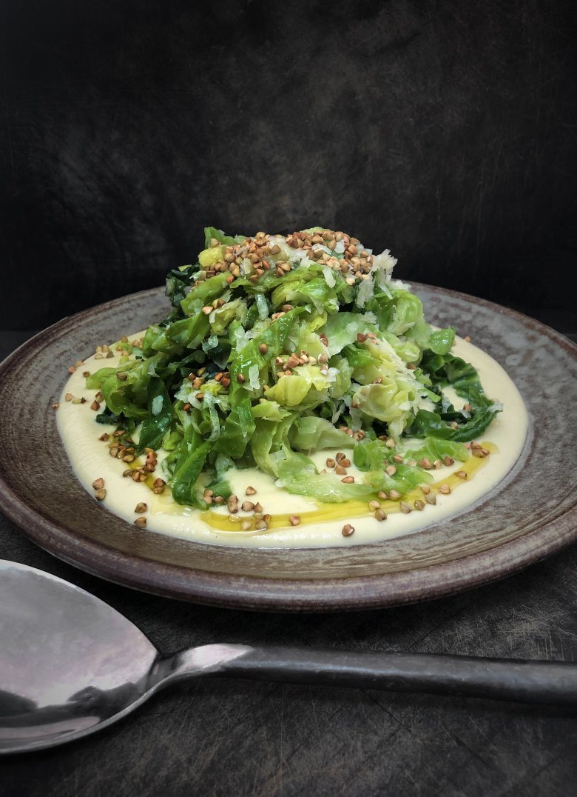

# [Cabbage cream with cabbage, parmesan and toasted buckwheat](https://www.thesaturdaypaper.com.au/food/side-dish/2021/09/30/cabbage-cream-with-cabbage-parmesan-and-toasted-buckwheat/163067760012381)

Back in the good old days, when you could move more than five kilometres and make plans in advance, we booked a holiday house for Christmas – 10 days by the beach with a smattering of overlapping friends. Our restaurants were closed, which meant any surplus produce became part of the packing, along with the already-ordered excessive amount of food. In among the stray bits were two-and-a-half cabbages, one red and the rest green.

Upon arrival, the Tetris-like game of fitting that much food into one fridge began, with the sturdier items relegated to the laundry. And then the games began: whoever was on cooking duty had to include some form of cabbage dish as we attempted to consume all we had brought. There was a lot of barbecued cabbage and many fine salads – one with mint, chives and parmesan, dressed with olive oil and lemon, that became a staple on my then restaurant’s menu. The cabbages became part of our holiday, showing their versatility and longevity while living happily in a corner and still maintaining their dignity.

I doubt many people would claim the cabbage as their favourite vegetable, which is a shame, as it is a quiet achiever, toiling fearlessly in the background. When raw it can taste gentle and soft, or swing the other way with bitter and mustardy sharp notes. This is highly dependent on the varietal and the weather. Cook a cabbage and you are presented with even more flavours, buttery and sweet among them.

Apart from their flavour range, cabbages’ ability to adapt to different cooking methods is also to be applauded. They love a long cook, are delicious braised, and perfect as the outer layer to wrap various fillings. I love cabbage in soup and, along with onions and garlic, it is always at the base of the many versions of Italian minestra that are a winter go-to for me. The leaves also stand up to a good dark charring.

One night recently we ate half a head as the main part of dinner, caramelised on the outside, basted in butter and seasoned with fish sauce and lemon. Cabbage works equally well in a quick cook. One of the staples at Lankan Filling Station is a cabbage mallung, cooked in a wok with ghee, turmeric, mustard seeds and curry leaves. It has fresh coconut thrown in at the end, which teases out the sweet notes of the vegetable and complements the smokiness.

Cabbage is also very happy pickled or fermented – kimchi being a fine example of this – and is also a delight eaten raw as a refreshing counterpoint. There is the sweet relief of a piece of cabbage among a searingly hot som tum. Or a spoonful of coleslaw, fatty yet acidic, while eating crumbed meat or fish coated in batter and deep friend.

At home, we get a weekly vegetable box, the joy both from the sparkling produce it contains and the fact we don’t have to choose. Because of its long season and durability, there is often a cabbage lurking. So, as with that Christmas holiday, we get creative. The beginnings of this recipe started one night when we had a ragu in the fridge but didn’t want pasta. Instead I shredded, blanched and dressed some cabbage and served it alongside the ragu. It was very pleasing.

The next week brought another cabbage, and this version highlights the vegetable’s different flavours and textures. There’s crunch and there’s creaminess, richness and bite. It is a wonderfully complete dish paying homage to the humble cabbage.

_Serves 4 as a side dish_

## Ingredients

**Cabbage cream with cabbage, parmesan and toasted buckwheat**

-   1 whole cabbage, green or savoy (about 500-600g)
-   20g butter
-   1 medium brown onion, thinly sliced
-   salt flakes
-   white pepper
-   200ml pouring cream
-   2 tsp/16g buckwheat
-   40g grated parmesan
-   olive oil
-   squeeze of lemon

**Method**

First remove the outer layers of the cabbage until you reach the pale heart. Do this by pulling the leaves away and trimming down the core at the base as you go. This will help to allow you to easily peel away the leaves.

Shred the outer leaves, cutting them into about one-centimetre strips. Blanch them in a saucepan of boiling salted water for one minute before refreshing under cold running water. Strain the cabbage, squeeze it out and then set aside.

Finely slice the heart of the cabbage.

Place a small saucepan over a medium heat, add the butter to melt and then add the onion and cabbage. Season well and cook gently, stirring, making sure not to colour the mix at all. Cook until it starts to soften (three to four minutes).

Add in the cream, cover with a cartouche, turn the heat to low and let this mix cook until it’s almost falling apart and the cream has reduced by about half (18-20 minutes).

Blend this mix until super smooth and do a final taste for seasoning.

While this is cooking, place your buckwheat in a small frying pan over a medium heat and cook to toast, jiggling the pan as you go. Cook until the buckwheat has darkened slightly and becomes crunchy (about 5-6 minutes). Turn out and set aside.

Mix your blanched cabbage in a bowl with the parmesan and season with olive oil, salt and a touch of lemon.

You will only need about two-thirds of the cabbage cream. The rest will last in your fridge for about a week; it can almost be eaten like a soup and is also good served with a fried egg on top.

To serve, spread the warm cabbage cream on the bottom of a shallow bowl or plate.

Gently place the seasoned cabbage on top and then finish the dish with the toasted buckwheat. Drizzle with an extra splash of olive oil.

Serve warm or at room temperature.