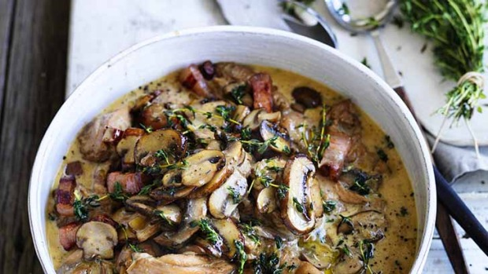

# [Chicken braised with mushroom & thyme](https://www.goodfood.com.au/recipes/in-season/chicken-braised-with-mushroom-and-thyme-20150504-3vcpd)

*Serves: 4*

## Ingredients

10g dried porcini mushrooms

100g button mushrooms

150g swiss mushrooms

150g portobello mushrooms

3 tbsp olive oil

2 small brown onions, sliced

2 tsp chopped thyme leaves

80g rindless pancetta, 1⁄2 cm dice

1 tsp sea salt

600g skinless chicken thigh fillets, cut in quarters

1⁄2 tbsp Worcestershire sauce

1/2 tbsp dijon mustard

1⁄4 cup white wine

1 cup chicken stock, approximately

1 cup pouring cream

freshly ground pepper

1. Soak porcini mushrooms in boiling water for 20 minutes or until soft. Drain and chop. Slice button and swiss mushrooms. Cut portobello mushrooms in half and slice.

2. Heat half the oil over medium-high heat in a deep, wide saucepan with a tight-fitting lid. Cook the onions with the thyme, pancetta and salt for three minutes then add the mushrooms (except porcini). Cook until all the Ingredients turn golden brown. Remove from pan and set aside.

3. Add remaining oil to pan. Brown chicken pieces then return mushroom mix to pan. Add the porcini mushrooms, Worcestershire sauce and mustard and cook for one minute. Deglaze with wine, scraping the bottom of the pan with a wooden spoon. Add stock and bring to a boil. Turn the chicken, reduce the heat, and simmer with the lid on for five minutes.

4. Add the cream and continue to simmer until the chicken is tender and the sauce has thickened. Add pepper, check the seasoning, and serve.

**Serving suggestion:** Serve with [Neil Perry's polenta chips](http://www.goodfood.com.au/good-food/cook/recipe/polenta-chips-20150504-3vcpe.html).

**TIPS:**
* Buy the best free-range or organic chicken possible

* If you don't have any pancetta handy, smoky bacon is just as good

* Although I love the mix of mushrooms, if you only have one type of mushroom, that's more than fine

* If it is too thick, simply thin it with water

[Chicken braised with mushroom and thyme](https://www.goodfood.com.au/recipes/in-season/chicken-braised-with-mushroom-and-thyme-20150504-3vcpd)