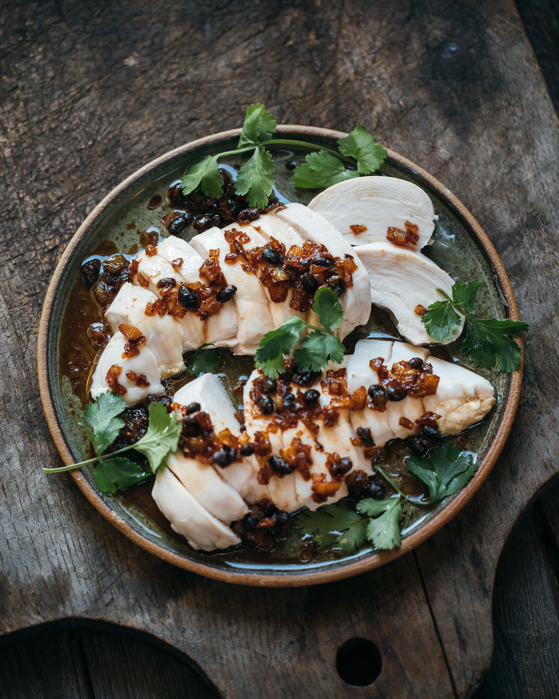

# [Chicken breast with garlic and black bean dressing](https://adamliaw.com/recipe/chicken-breast-with-garlic-and-black-bean-dressing/)

[

I use a steam oven to safely cook the chicken to 62C. (Holding it at that temperature for just 10 minutes will pasteurise it so that it’s entirely safe to eat.) If you don’t have a steam oven you can poach the chicken in water at a very, very low simmer (basically just steaming) for about 15 minutes.

## Ingredients

* ¼ cup canola oil
* ½ small onion
* 5 cloves garlic
* 1 tbsp salted black beans
* ¼ tsp sugar
* 2 tsp soy sauce
* ¼ tsp sugar
* 2 chicken breasts
* a handful of coriander sprigs, to serve

## Method

Bring a large pot of water to a very low simmer and add the chicken breasts. Simmer over very low heat for about 15 minutes then remove and rest for 3 minutes.

While the chicken is cooking add the canola oil to a small saucepan over medium heat. Add the onion and cook for about 2 minutes, add the garlic and continue to cook, stirring regularly until the garlic is golden brown. Add the black beans and sugar and cook for a further minute until the black beans are fragrant. Stir through the soy sauce and remove from the heat.

Slice the chicken and spoon over the dressing. Garnish with a few coriander sprigs and serve.