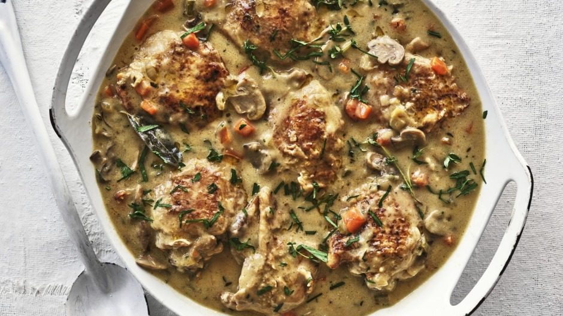

# [Chicken Fricassee](https://www.goodfood.com.au/recipes/adam-liaws-chicken-fricassee-20220621-h24kxe)

**Time:** 30 mins - 1 hour
**Serves:** 6-8

Julia Child once described fricassee as 'halfway between a saute and a stew' and I think that's on the money. Browned chicken sits in a rich sauce of wine, cream and stock – not too much sauce, but just enough.

## Ingredients

* 1 tbsp vegetable oil
* 8 chicken thigh cutlets, skin on, bone in
* salt and pepper, to season
* 25g butter
* 1 large onion, peeled and diced
* 1 carrot, peeled and diced
* 1 stick celery, diced
* 2 garlic cloves, roughly chopped
* 200g button mushrooms, sliced
* 4 bay leaves
* 6 sprigs thyme
* 2 tbsp flour
* ½ cup white wine
* 500ml chicken stock
* 300ml thickened cream
* 1 tsp finely shredded parsley leaves

## Method

1\. Heat a large lidded frypan over high heat and add the oil. Fry the chicken cutlets in batches until the skin is well browned, then remove from the pan. They don't need to be cooked through. 

2\. Add the butter to the pan, then the onion, carrot, celery, garlic and mushrooms. Season with salt and fry for about 10 minutes, until fragrant. Add the herbs and flour and cook for 2 minutes. Add the wine and stir until absorbed by the flour. 

3\. Add the stock and cream and return the chicken to the pan. Bring to a simmer, cover and simmer for 15 minutes, stirring once or twice and spooning a little of the sauce over the chicken as it cooks. Add the cream and simmer for a further 10 minutes, uncovered. Taste and adjust seasoning. Scatter with parsley to serve.

- Serve with rice, mashed potatoes, or roast potatoes, or polenta