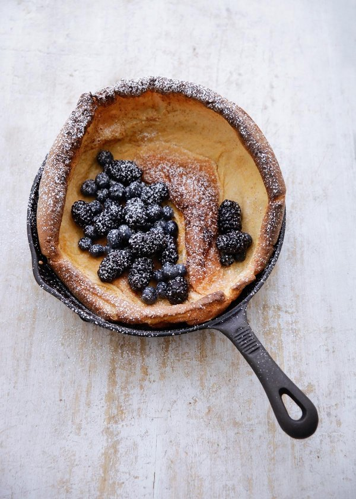

# [Dutch Baby](http://www.nigella.com/recipes/dutch-baby)

I’ve only ever eaten Dutch babies in the States, where they are brought out to you at the table with great pomp: great pancakes puffed up and golden, still in the cast-iron skillets they were cooked in. Obviously, I had to make my own at home. Not being a restaurant, I don’t want to be juggling with heavy pans, giving each person their own, so I’ve made mine a giant one for sharing; this ain’t no baby, that’s for sure.

While you can, of course, serve this mega-pancake just sprinkled with granulated sugar and lemon juice or, for a more diner taste, with a side order of bacon and maple syrup, I like it tumbled with berries and dusted with icing sugar with a bowl of creme fraiche within arm’s reach. I confess, I also add an ooze of maple syrup as I eat.

## Ingredients
Serves: 4-6

**For the Dutch Baby**

* 3 large eggs
* 1 tablespoon caster sugar
* 150 full fat milk
* 100 grams plain flour
* 1½ teaspoons vanilla paste (or extract)
* salt
* freshly grated nutmeg
* 25 grams unsalted butter

**To Serve**

* icing sugar
* berries
* creme fraiche
* maple syrup

## Method

You will need: 1 x 25cm cast-iron frying pan/skillet, or 1 x small roasting tin/pan approx. 28 x 21 x 4.5 cm

1. Preheat the oven to 220°C, and straightaway put your pan into the oven to heat up while you prepare the batter.
2. Beat the eggs with the caster sugar in an electric mixer until light and frothy. Whisk in the milk, flour, vanilla, salt and grated nutmeg, and beat until you have a smooth but thin batter.
3. Wearing a thick oven mitt, remove the pan from the oven and put the butter carefully into the hot pan or tin and swirl it to melt, then quickly pour in the batter and return it to the oven.
4. Bake until puffed and golden brown, about 18–20 minutes.
5. Serve dusted with icing sugar, and a tumble of berries, if the idea appeals; otherwise, see Intro.

Additional Information

MAKE AHEAD NOTE: The batter can be made the night before. Cover and refrigerate until needed. Whisk briefly before using.