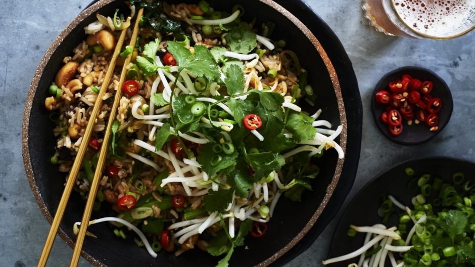

# [Fried rice with mushrooms and cashews](https://www.goodfood.com.au/recipes/fried-rice-with-mushrooms-and-cashews-20220902-h263td)

This is fried rice as a delicious and sustaining stand-alone meal. You can use white rice, but brown rice has a hearty, nuttier texture that I find irresistible. Serve with chopped chilli or fermented hot sauce on the side.

**Serves:** 6

## Ingredients

1 bunch of choy sum or gai lan, trimmed
80ml light soy sauce
2 tbsp oyster sauce or vegetarian oyster sauce
1 tsp sesame oil
2 tsp sugar
½ tsp ground white pepper
2 tbsp grapeseed oil
1 large onion, finely sliced
5 garlic cloves, sliced
100g fresh ginger, peeled and finely chopped
200g salted roasted cashews
2 tbsp sesame seeds
120g fresh wood-ear fungus, or shiitake or abalone mushrooms, finely shredded
500g long-grain brown rice, or white rice, cooked and cooled
100g beansprouts
5 spring onions, white and green parts, finely sliced
1 handful coriander leaves

## Method

1. Blanch the choy sum or gai lan in boiling salted water for 1 minute, then drain. Cut into 3cm pieces and set aside.

2. Combine the soy and oyster sauces, sesame oil, sugar and pepper in a small bowl. Stir to dissolve the sugar.

3. Heat a wok over high until very hot. Add the grapeseed oil and heat until shimmering. Add the onion, garlic, ginger, cashews and sesame seeds and stir-fry until the onion has softened (about 3 minutes).

4. Add the blanched choy sum or gai lan and cook for 1 minute, then add the fungus and rice and stir briskly until hot. Add the soy sauce mixture, beansprouts, shallots and coriander. Stir to combine, then serve.
