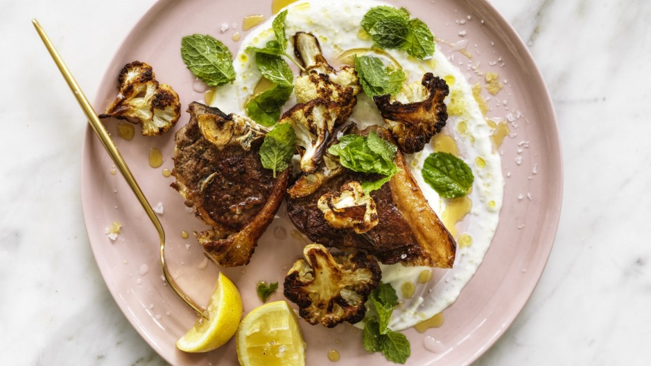

# [Lamb chops & cauliflower with garlic & lemon yoghurt](https://www.goodfood.com.au/recipes/lamb-chops-and-cauliflower-with-garlic-and-lemon-yoghurt-20200309-h1mecf)

The secret weapon in this yoghurt sauce is the mayonnaise. It adds a tangy hit … and you'd never guess it was there.

## Ingredients

2 cups vegetable oil, for deep frying (optional)

½ head cauliflower, separated into florets

salt and black pepper, to season

1 tbsp olive oil, plus extra to drizzle

8 lamb loin chops*

a few freshly torn mint leaves, to serve (optional)

lemon wedges, to serve

**Garlic and lemon yoghurt**

1 cup Greek-style yoghurt

2 tbsp mayonnaise

2 cloves garlic, grated

juice and grated rind of ½ lemon

¼ tsp salt

## Method

\1. For the garlic and lemon yoghurt, combine all the ingredients and set aside until ready to serve.

\2. If deep-frying the cauliflower, heat the vegetable oil to 175C in a small saucepan and cook the cauliflower in batches until golden, about 3 minutes for each batch. Set aside to drain on a wire rack and season with a little salt and pepper. If you prefer not to deep-fry, toss the cauliflower florets in olive oil and roast them on a baking sheet at 220C (200C fan-forced) for 30 minutes.

\3. Heat a frying pan over high heat and add the olive oil. Season the lamb chops well with salt and pepper, then fry in batches for about 3 minutes each side, plus one minute standing on the fat cap, for medium. Drizzle with a little olive oil and rest for at least 2 minutes.

\4. To serve, pour the yoghurt onto a serving plate and top with the lamb and cauliflower. Drizzle with olive oil, scatter with mint leaves (if using) and serve with lemon wedges and my [Green Greek salad](https://www.goodfood.com.au/recipes/green-greek-salad-20200309-h1mecw) (optional).

**Adam's tip:** Lamb chops are best cooked on direct heat – on a barbecue or in a pan. An oven is fine if you want them (very) well done, but a pan will give you a tastier crust while keeping the centre medium-rare.