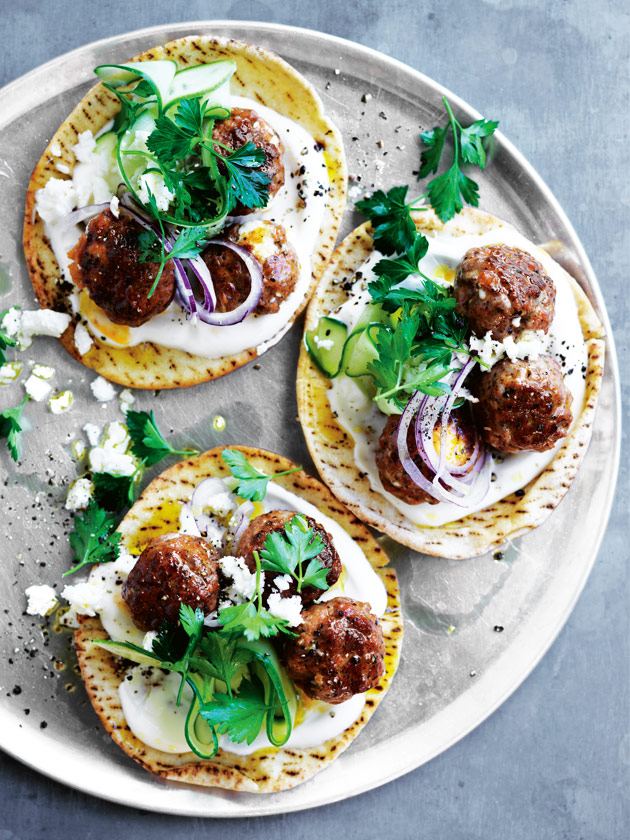

# [Lamb And Feta Meatball Flatbreads](https://www.donnahay.com.au/recipes/lunch/lamb-and-feta-meatball-flatbreadsv)

## Ingredients

- 600g lamb and mint sausages, cases removed
- 200g feta, crumbled
- 1 tablespoon extra virgin olive oil
- 8 medium flatbreads
- 1 cup (280g) natural Greek-style yoghurt
- 1 Lebanese cucumber, sliced into ribbons
- 1 red onion, thinly sliced
- 1 cup flat-leaf parsley leaves
- cracked black pepper, for sprinkling

## Method

1. Place the sausage meat and half the feta in a large bowl and mix to combine.
2. Roll tablespoonfuls of the mixture into balls.
3. Heat the oil in a large, non-stick frying pan over medium heat. Cook the meatballs for 12–14 minutes or until browned and cooked through.
4. Top the flatbreads with the yoghurt, meatballs, cucumber, onion, parsley and remaining feta. Sprinkle with pepper to serve. Serves 4.

*TIPS:*

*+ The meatballs can be made in advance and frozen raw. Thaw completely before cooking.*

*+ You can swap the mince in these recipes for any of your favourite sausages. Just remove the meat from the casings before using.*