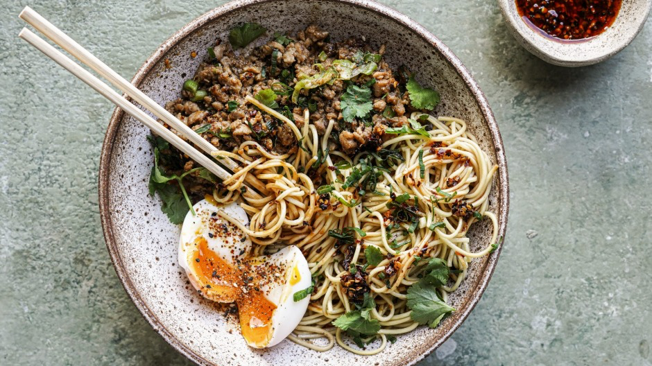

# [Peanut Butter Miso Chicken Noodle Stir-Fry](https://www.goodfood.com.au/recipes/slurpy-peanut-butter-miso-chicken-noodle-stirfry-20220621-h24l12)

**Serves:** 4

## ## Ingredients

1 tbsp mirin
1 tbsp soy sauce
3 tbsp sweet soy
2 tbsp peanut butter
1 tsp white miso
1 tbsp grapeseed oil
1 small brown onion, diced
1 garlic clove, crushed
350g chicken mince
1 cup chicken stock
270g packet of ramen or soba noodles

**To serve**
4 soft-boiled eggs, halved
1-2 tbsp crunchy chilli oil per serve (or to taste; optional)
2 tbsp coriander leaves, chopped
1 tbsp spring onion, sliced

## Method

1. Combine the mirin, soy, sweet soy, peanut butter and miso in a bowl and stir with a fork until the peanut butter is fully incorporated into the liquid. Set aside.

2. Place a frypan over low-medium heat. Add the oil, and once shimmering and hot, add the onion and sweat until soft and translucent, about 5 minutes. Add the garlic and cook for another minute or until fragrant.

3. Increase the heat to medium-high and add the chicken mince. Stir-fry until the mince has cooked through, about 5 minutes. Add the peanut sauce and cook, stirring to coat. Turn to a low simmer and add the stock.

4. While the chicken is simmering, bring a pot of water to the boil. Cook the noodles according to packet instructions. Strain and divide among 4 bowls. Spoon over the chicken mixture and any residual juices. Scatter with coriander and spring onion and top each bowl with a halved jammy egg and crunchy chilli oil, if using.