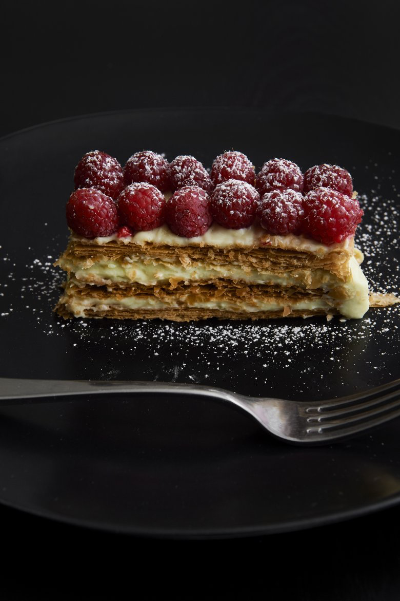

# [Raspberry & Pistacchio Mille Feuille](https://www.thesaturdaypaper.com.au/2021/05/31/pistachio-and-raspberry-mille-feuille/162039600011592)

Nothing says “I love you” more to my mother than a bit of pastry frippery for afternoon tea on Mother’s Day. And what could be better than a slightly more modern take on the vanilla slice? A lovely pistachio and raspberry mille-feuille. While the literal translation of thousand sheets is not quite correct, it still gives the idea.

Puff pastry is an absolute delight for me to make, but it’s not a skill that everyone possesses, so there are some very good butter puffs out there in the grocery store freezers. Puff pastry is made by making a flour and water dough and then rolling butter through it, a process called laminating the dough. Puff even has its own mathematical formula l = (f+1) n where l represents the layers, f the number of folds in a move and n is the number of times that move is repeated. When made properly there are usually 729 layers to the pastry, but I digress.

The main art to making a perfect slice is to get the pastry perfectly cooked. If it is undercooked, the slice will be difficult to cut and difficult to eat. If the pastry is cooked through, it will slice like a dream and seemingly dissolve in the mouth when eaten. Also don’t be frightened to get a little darker colour on the pastry, as the slightest hint of bitterness cuts back the dessert’s inherent sweetness.

Lastly, the pistachio pastry cream is a bit of a flourish. Pistachio pastes are often used to flavour ice-cream and are available at specialist food stores. You can always skip this and add some vanilla to the pastry cream for a more traditional finish.

### Pistachio and raspberry mille-feuille
*Makes 8*

500ml milk

125g castor sugar

6 egg yolks

50g cornflour mixed with a little milk

1 tsp sweetened pistachio paste

1 sheet puff pastry, 30x20cm

about 250ml pure cream

3 punnets raspberries

Place the milk in a heavy-based saucepan and bring to scalding point. Remove from the heat.

In a stand mixer fitted with the whisk attachment, whisk the sugar and egg yolks for five minutes or until pale. Add the cornflour paste, then the hot milk and whisk until combined.

Return the mixture to a clean saucepan, add the pistachio paste and place over a medium heat. Bring to the boil, stirring constantly, until the mixture is smooth and thick.

Remove from the heat and place in a clean container. Closely cover the surface with plastic wrap to prevent a skin forming and store in the refrigerator until cold.

Preheat the oven to 210°C. You’ll need two baking sheets that fit the pastry. Grease one of the trays and lay the pastry on it. Grease the back of the other tray and sandwich the pastry in between the two trays. Alternatively you can place baking paper on the bottom of one tray, then the pastry, then another sheet of baking paper. The heavier the trays are the better.

Place the trays and pastry in the oven and cook for 10 minutes. If your trays are a little lightweight, you may need to push the pastry down. Keep checking the colour of the pastry, as many ovens differ. You want it to be golden brown.

When golden brown turn the oven down to 160°C and continue cooking until the pastry is cooked through. If it still lifts a bit during cooking, keep pushing it down. It is imperative that the pastry is cooked through so it can be cut neatly. Once cooked, remove from the oven and cool on a wire rack.

Remove the pastry cream from the refrigerator. Weigh how much you have and then measure out half the weight of cream. Whip the cream until stiff peaks form and then add the pastry cream, one large spoonful at a time. When thick, smooth and completely combined, stop whisking.

Cut the pastry into three even strips. Smear just under half the pastry cream and cream mix on the first layer. Add the second layer of pastry. Smear almost all the rest of the pastry cream on the second layer. Place the third piece of pastry on top and put a light lick of pastry cream mix on the top, just to help secure the raspberries.

Arrange the raspberries on top. Dust with a little icing sugar and serve. Cut into slices with a sharp, serrated knife.
- - - -
#recipe/dessert