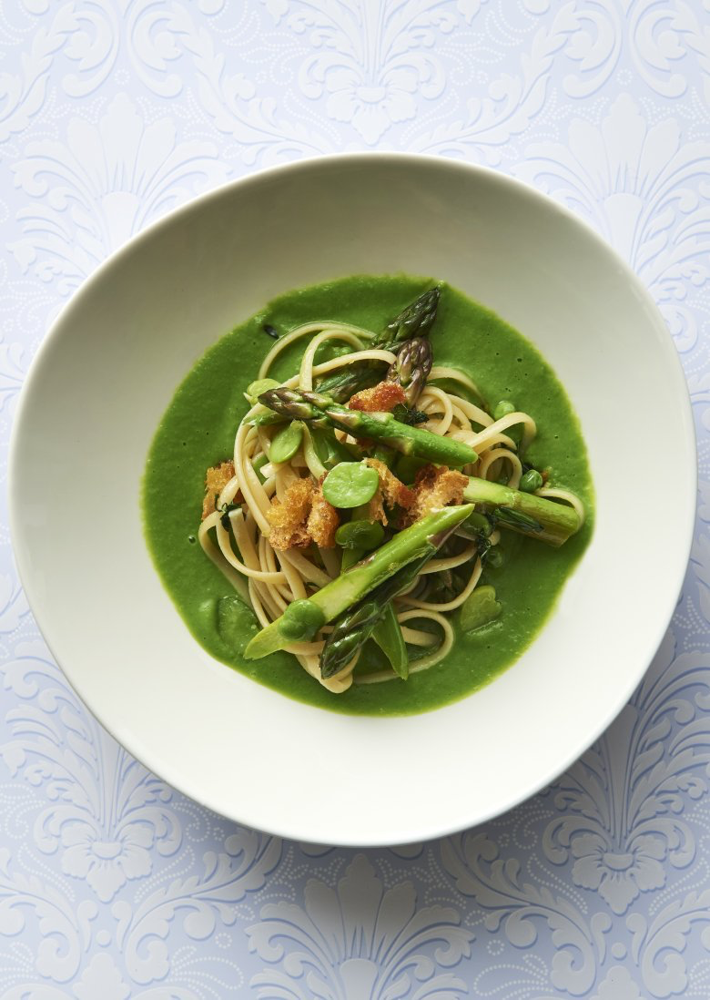

# [Spring linguini on pea purée](https://www.thesaturdaypaper.com.au/food/dinner/2018/10/31/spring-linguini-pea-puree/15405588007036)

This spring linguini is a beautiful dish that can spin on a five-cent piece to cater for all. The recipe is for a vegan bowl of pasta. But if you eat dairy, it is delightful with fetta or parmesan. If you eat meat, it is delicious with crisp chards of prosciutto. And if you are coeliac, replace the pasta with some beautiful green leaves, omit the croutes and have a spring salad that is along the same theme as everybody else’s pasta. And you can orchestrate all of that as you are plating up, just like I do at the kitchen bench as I work through my customer base that is vegan, vegetarian, pregnant, FODMAP, coeliac, no onion/garlic, no nuts, no dairy…

**Ingredients**

_Serves 8_

-   500g broad beans
-   250g asparagus
-   500g baby peas, podded weight
-   500g durum wheat, bronze-extruded linguini
-   50ml extra virgin olive oil
-   1 tbsp chopped chervil
-   1 tbsp chopped thyme
-   1 tbsp snipped chives

-   ½ cup really coarse breadcrumbs, sprinkled with olive oil and salt and toasted in a 180ºC oven until golden

**Method**

1.  Bring a large pot of salted water to the boil for the pasta. While it’s heating, put a small pot of water on for the peas and a small pot of water on for the broad beans.
2.  Pod the broad beans, snap the asparagus and cut into spoon-sized pieces. When the little pots of water have boiled, cook the peas until just done, and blanch the broad beans. Set a quarter of the peas aside and purée the rest in a food processor. Adjust seasoning and set aside. Slip the broad beans out of their skins.
3.  Cook the pasta and, about three minutes before it is ready, add the asparagus pieces. Drain. Place a large frying pan on the stove and warm the olive oil. Add the pasta, reserved peas, asparagus, broad beans, herbs and croutes and toss. Check the seasoning and add salt and pepper to taste.
4.  Warm the pea purée, place on the bottom of the bowls and place the pasta on top.