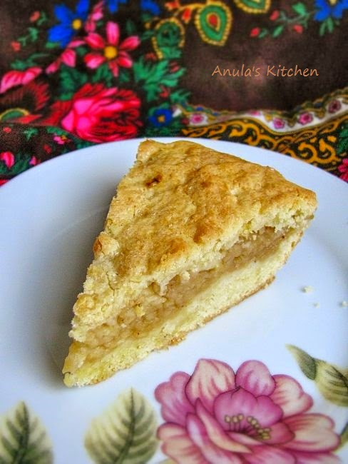

# [Szarlotka](http://www.anulaskitchen.com/2014/11/polish-apple-cake-szarlotka.html)

## Ingredients
- 1 1/2 cup plain flour  
- 1/2 cup caster sugar  
- 115g  butter, soft  
- 1 teaspoon baking powder  
- 1 teaspoon vegan natural yogurt   
- 1 egg
- pinch of salt  
- 5 apples, pealed, cored and grated  
- 1/2 teaspoon cinnamon  
- 1 teaspoon demerara sugar

## Method  
Preheat the oven to 180 C and line a round 20 cm cake baking tin. 

Mix together flour, sugar and baking powder. Cut butter into pieces and add to the flour. 
Using your fingers mix flour and butter together until it resembles small breadcrumbs. 

Add the aquafaba egg and yogurt and mix well together, until it becomes a soft ball - it will be very soft and quite sticky. 

Divide the dough in half and put each half into the plastic wrap/bag and pop it into the fridge for an hour.

  In the meantime prepare your apples, grate them (using the biggest size attachment in your kitchen robot or on hand grater). 

Add cinnamon to grated apples and put aside so you can "deal" with the dough. 

Take one half of the dough and using your fingers spread it evenly on the bottom of the baking tin.

Cover generously with apple and follow with the second half of the dough - which you can grate, tear apart with your fingers, and cover the apples completely. 

Sprinkle the top with demerara sugar. 

Bake for about 45-50 minutes until golden in colour. 
Cool for a while in the tin before taking out and cooling completely. 

- Serve sprinkled with icing sugar, side of whipped cream or vanilla ice-cream