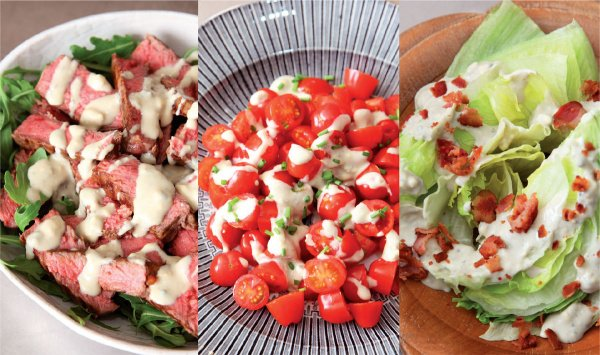

# [Universal blue-cheese dressing](https://www.nigella.com/recipes/universally-useful-blue-cheese-dressing)

If you like blue cheese - as I, swooningly, do - then know that this, dribbled over sliced, sweet tomatoes along with a torn-off log of baguette is a perfect enough supper just as it is. And you can make a fabulously retro US-steakhouse-style starter, by cutting a head of iceberg lettuce into wedges and dolloping each crunchy wedge with the dressing followed by a scattering of crisp-fried bacon crumbles. And it makes a fabulous sauce for leftover rare roast beef. It’s obviously divine with baked potatoes, too, and should you want just to eat as a dip with chips or crudités, please know that I fully support you in this!

    

## Ingredients

Makes: 250ml/1 cup

-   150 grams blue cheese (crumbled)
-   1 teaspoon worcestershire sauce
-   1 teaspoon brown sauce (such as A1 or HP)
-   75 millilitres buttermilk or runny plain yogurt
-   45 millilitres full fat milk
-   1 teaspoon raw apple cider vinegar (or good white wine vinegar)

## Method

1.  Put the crumbled cheese into a bowl, add the Worcestershire sauce, brown sauce, buttermilk, milk and the vinegar and mix gently until well combined.
2.  Thin if necessary with a little iced water. Chill until needed.

MAKE AHEAD NOTE  
The dressing will keep for 3–4 days in covered container in fridge – store in cold part of fridge rather than in the door.